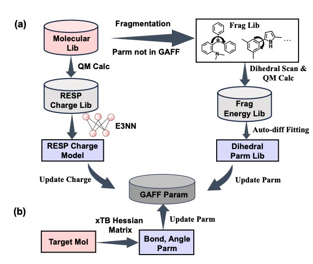

## Data-Driven Parametrization of All-atom Force Fields for Organic Semiconductors
[[Paper](https://chemrxiv.org/engage/api-gateway/chemrxiv/assets/orp/resource/item/676e183d6dde43c90877c52c/original/data-driven-parametrization-of-all-atom-force-fields-for-organic-semiconductors.pdf)] Guojiang Zhao, Taiping Hu, Hongshuai Wang, Lirong Wu, Shuqi Lu, FengTianCi Yang, Shangqian Chen, Zhifeng Gao,  Xinyan Wang, Zheng Cheng. 10.26434/chemrxiv-2024-bl6f9  

Organic semiconductors (OSCs) composed of π conjugated molecules have gained significant interest in the study of bulk properties such as molecular arrangement and electron mobility. However, the types of torsion in the traditional force field (FF) are limited, fail to cover the chemical space of π conjugated molecules, and thus, hinder further molecular dynamics (MD) simulation to deduce these bulk properties through statistical mechanics. In this study, we introduce OSCFF, which supports various types of torsion for conjugated molecules and enables the generation of RESP charges with high accuracy through the neural network (NN). To develop the OSCFF, we construct two expansive and highly diverse molecular datasets: one consists of around 56,000 fragment geometries with torsion profiles, and another consists of around 472,000 optimized molecule geometries with RESP charges. The OSCFF demonstrates high accuracy in predicting torsional energy profiles, RESP charges, and the radial distribution function (RDF) for conjugated molecule systems. Furthermore, our OSCFF is compatible with the GAFF2 and a pipeline is provided for automatically generating the Gromacs supported topology file. We expect OSCFF will reduce the manual effort required for MD simulations of OSCs and serve as a valuable tool for multiple stages of OSCs design.

## Overall Architecture:
<p align="center">
  
  <br/>
  <br/>
</p>

## Dependencies
 - [DeePDih](https://github.com/zhengcheng233/DeePDih), check its [Installation Documentation](https://github.com/zhengcheng233/DeePDih).
 - rdkit==2024.09.3, install via `pip install rdkit-pypi==2024.09.3`.
 - [e3_layer](https://github.com/zhengcheng233/e3_layer), check its [Installation Documentation](https://github.com/zhengcheng233/e3_layer)

## Download dataset 
#### 1. Download dataset `data.tar.gz` from [Test Dataset of OSCFF(force field for organic semiconductors)](https://zenodo.org/records/15107701). 
#### 2. Then unzip the `data.tar.gz` to `./`.

## Infer 
#### 1. Infer the dihedral scan energy  
##### 1.1 Static all the dihedral scan energies
```
update the force field: cd ./code/dihedral_scan && python evaluate.py complete_parm
evaluate the force field: cd ./code/dihedral_scan && python evaluate.py evaluate_ff
```
The results files is named as `check.npz`, while the labels of dihedral scan energies are named as `qm_energy` and the predictions of dihedral scan energies are named as `mm_energy`.
##### 1.2 Static the dihedral scan energies of single molecule
if we want to evaluate the performance of OSCFF for `case_0`: 
```
cd ./code/dihedral_single && python evaluate.py complete_parm 0 
cd ./code/dihedral_single && python evaluate.py evaluate_ff_single 0 
```
#### 2. Infer the RESP charges
##### 2.1 Predict all the RESP charges
```
cd ./code/resp_q_molecule && python evalulate.py 
```
The results files is named as `resp_q_evaluate.npz`, while the labels of RESP charges are named as `q_label` and the predictions of RESP charges are named as `q_pred`.
##### 2.2 Predict the RESP charges of polymer  
if we want to evaluate the performance of OSCFF for `P3CN4HT`: 
```
cd ./code/resp_q_polymer && python evalulate.py P3CN4HT
```
The results files is named as `resp_q_P3CN4HT.npz`, while the labels of RESP charges are named as `q_label` and the predictions of RESP charges are named as `q_pred`.

#### 3. Infer the RDF 
if we want to run the MD simulations for `bcp`:
```
cd ./code/rdf_calc/bcp/gaff && cp ../../run.sh . && bash run.sh 
cd ./code/rdf_calc/bcp/oscff && cp ../../run.sh . && bash run.sh 
```

## Licence 
This project is licensed under the terms of the MIT license. 
